# FlowBatch: bulk generator for Google Flow

FlowBatch is a Chrome side-panel extension. It runs a queue of 20–30+ prompts in
[Google Flow](https://flow.google.com/), one prompt at a time. For each prompt it attaches the
reference images mentioned in the prompt, types the prompt, and submits it. Then it waits until
Flow finishes (or reports an error), downloads the result, and moves on to the next prompt.
It also includes a frame extractor that turns a video into stills every N seconds — from a local file,
a direct video URL, or by capturing whatever is playing in a browser tab.

## Screenshots

<p align="center">
  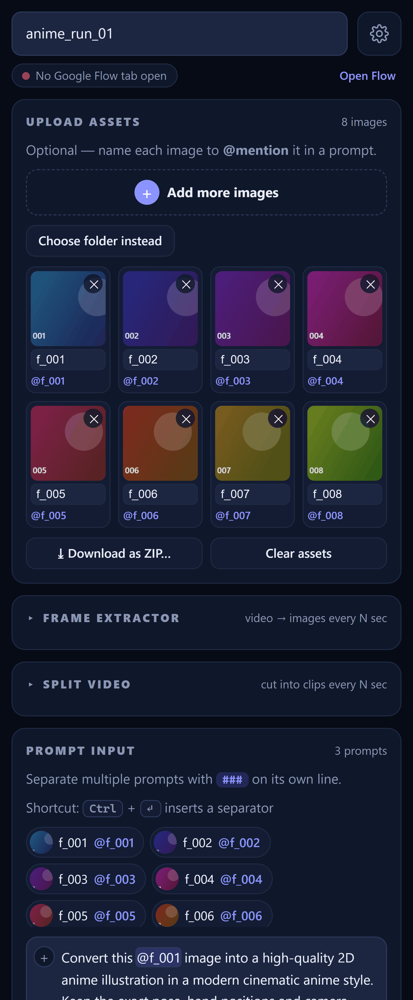
  &nbsp;
  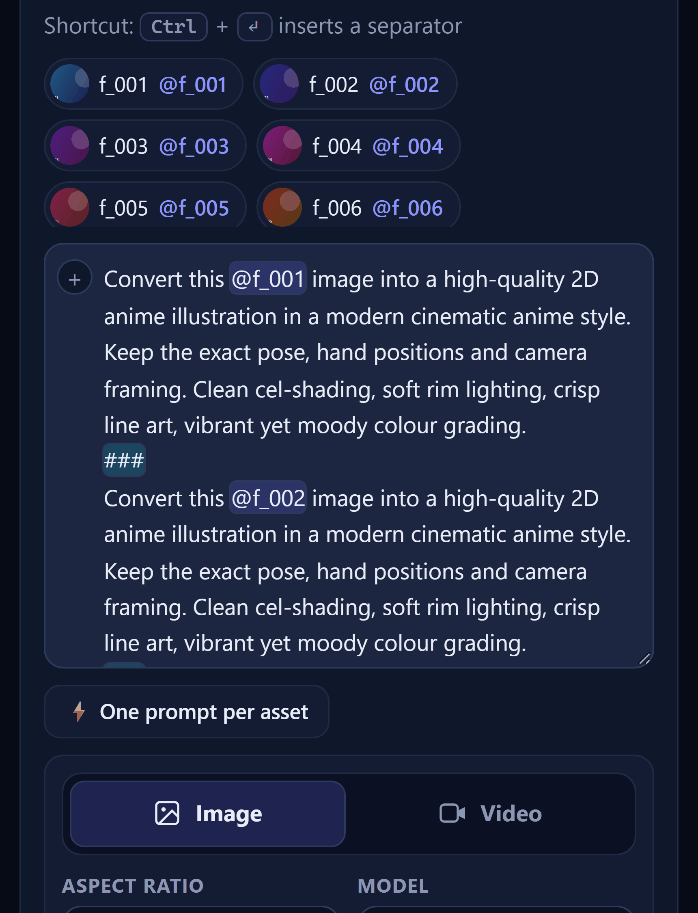
</p>
<p align="center"><sub><b>The side panel</b> — reference images, prompts and generation options &nbsp;·&nbsp; <b>Prompt editor</b> — @mentions and <code>###</code> separators highlighted as you type</sub></p>

<p align="center">
  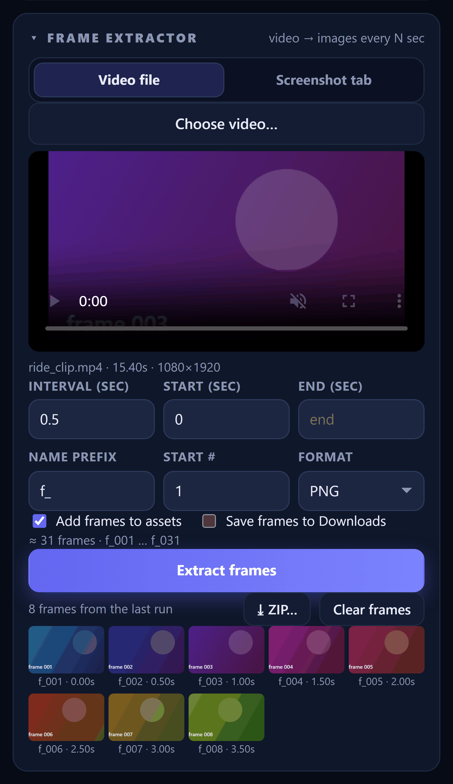
  &nbsp;
  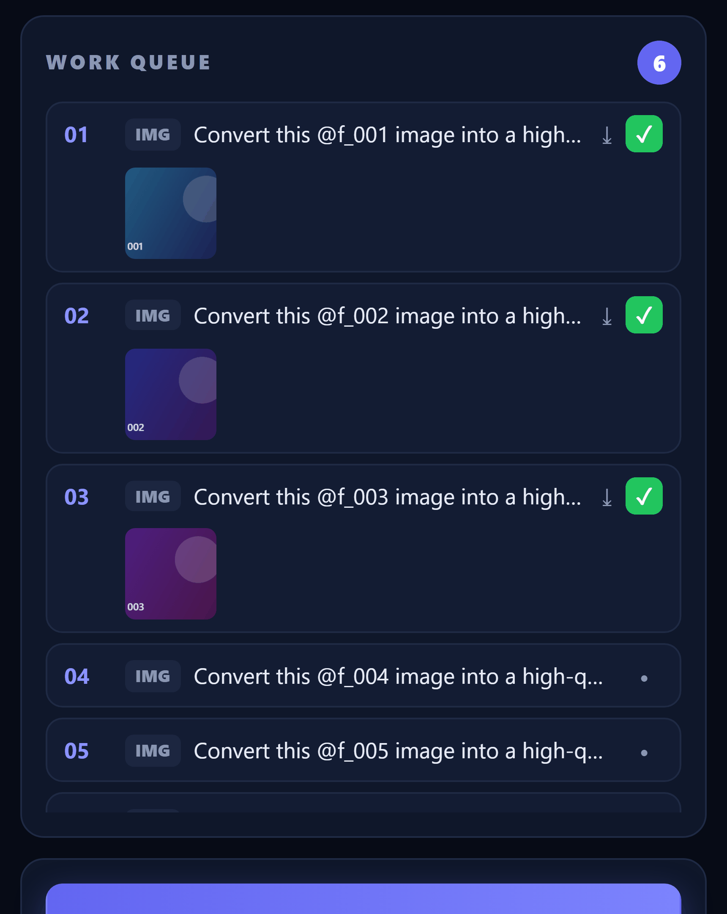
</p>
<p align="center"><sub><b>Frame extractor</b> — video preview, interval, and the extracted frame strip &nbsp;·&nbsp; <b>Work queue</b> — one row per prompt, with result thumbnails</sub></p>

<p align="center">
  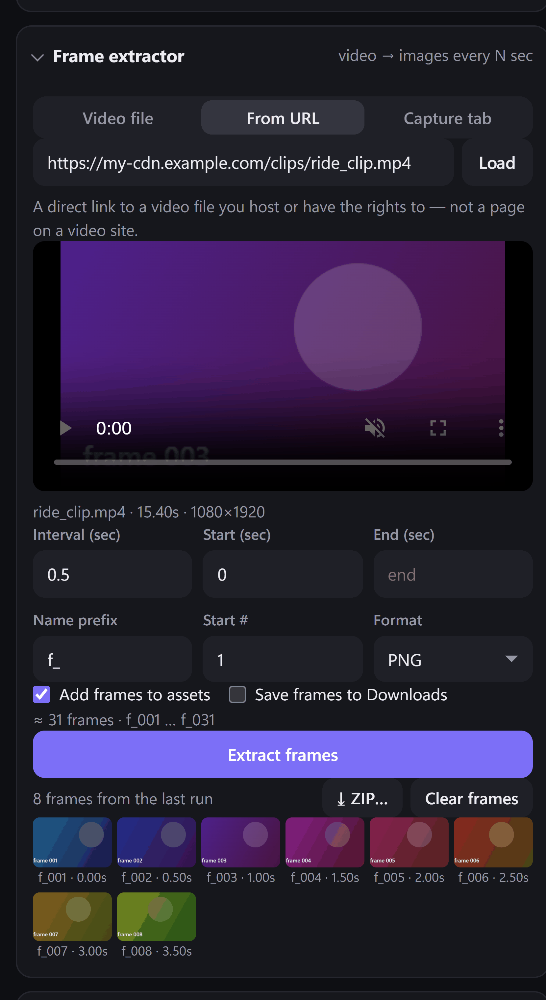
  &nbsp;
  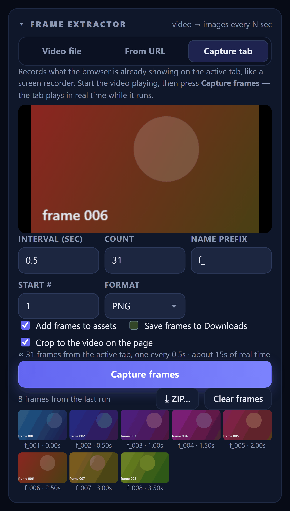
</p>
<p align="center"><sub><b>From URL</b> — a direct link to a video file you host &nbsp;·&nbsp; <b>Capture tab</b> — frames from whatever is playing in the browser, cropped to the video</sub></p>

<p align="center">
  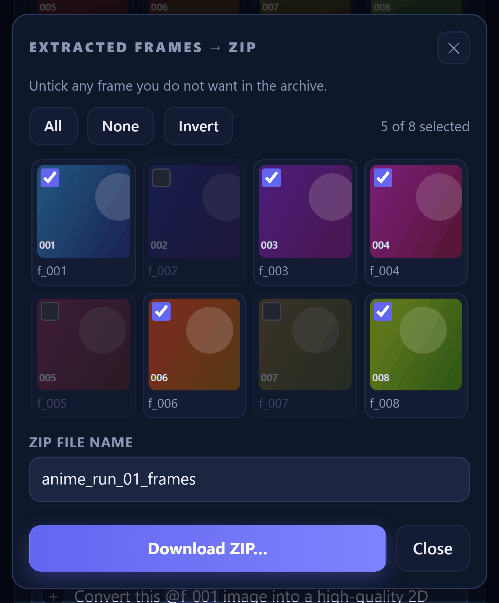
  &nbsp;
  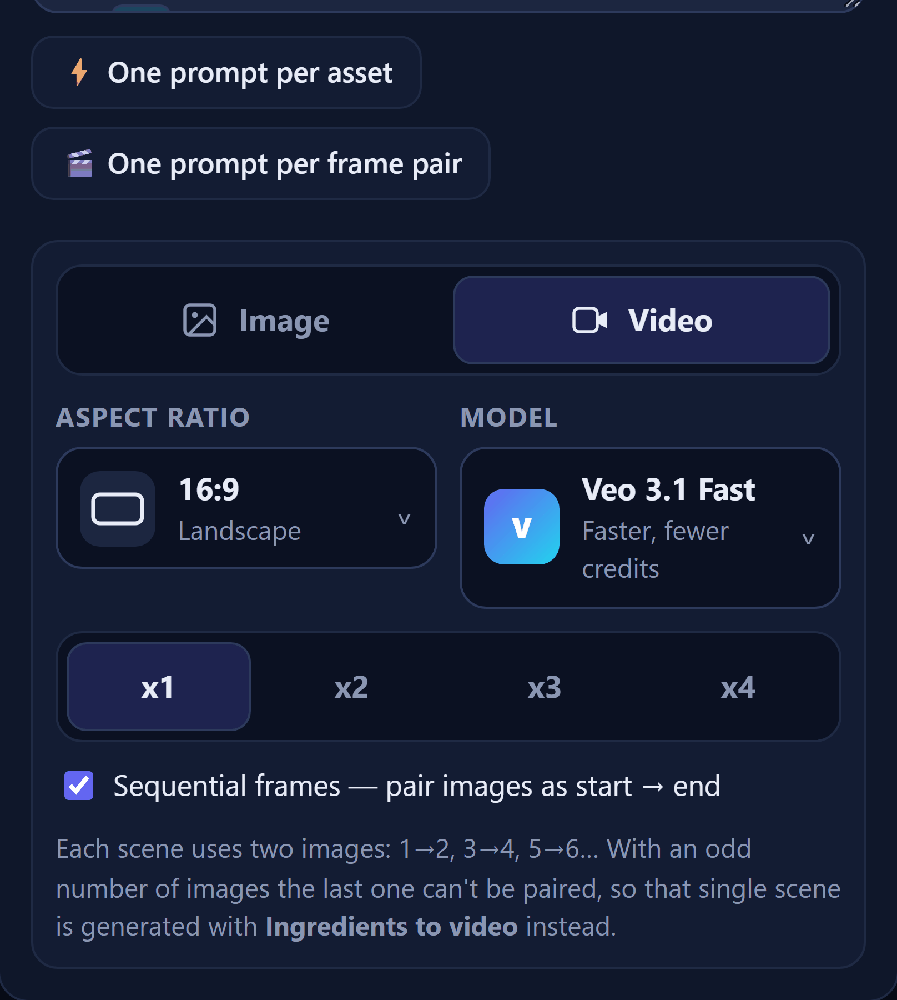
</p>
<p align="center"><sub><b>ZIP picker</b> — untick anything you do not want, then choose where to save &nbsp;·&nbsp; <b>Sequential frames</b> — pair images as start → end for Flow's Frames to video</sub></p>

<p align="center">
  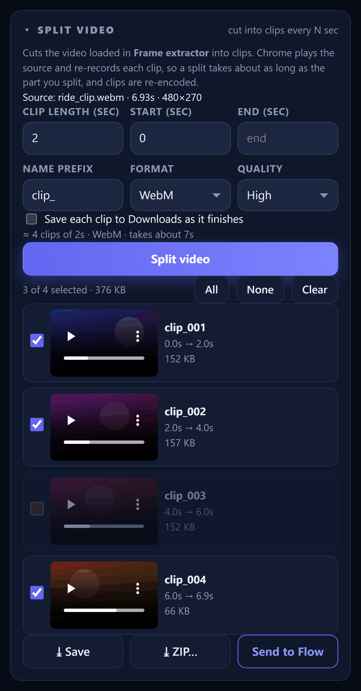
  &nbsp;
  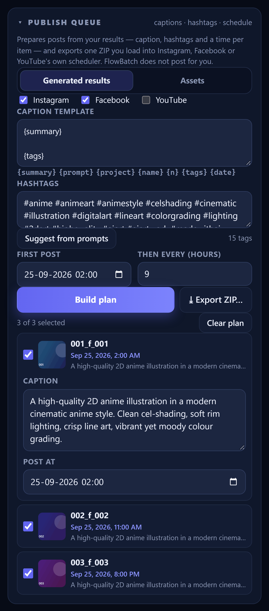
</p>
<p align="center"><sub><b>Split video</b> &mdash; clips every N seconds; save, zip or send the ones you tick to Flow &nbsp;&middot;&nbsp; <b>Publish queue</b> &mdash; captions from your prompts, suggested hashtags and a posting time per item</sub></p>

<p align="center">
  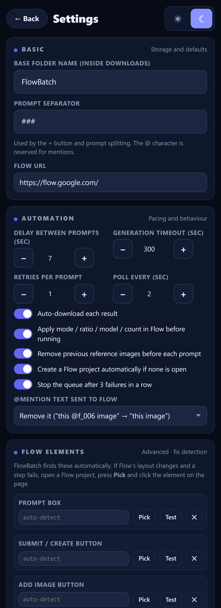
</p>
<p align="center"><sub><b>Settings</b> &mdash; pacing, behaviour and Flow element calibration</sub></p>

<sub><i>The panel is shown with placeholder images standing in for real video frames and Flow output.</i></sub>

## Install (unpacked)

1. Open `chrome://extensions` and turn on **Developer mode** (top right).
2. Click **Load unpacked** and select this `FlowBatch` folder.
3. Pin the extension, then click its icon. The panel opens on the right side of the window.
4. Open a Google Flow tab. If Flow was already open before you installed the extension, reload that tab once.

After you edit any file, click **Reload** on the extension card and reload the Flow tab.

## Typical workflow (video → anime frames)

1. **Frame extractor** (expand the card): pick where the video comes from — see
   [Where frames come from](#where-frames-come-from) — then set **Interval** (for example, `0.5` saves 2 frames per
   second). Set the prefix to `f_` and the start number to `1`, then click **Extract frames**. The frames are added to
   **Upload assets** as `f_001`, `f_002`, and so on. Tick *Save frames to Downloads* if you also want them saved as files.
   After a run, **⤓ ZIP…** packs the frames into one archive and **Clear frames** throws the whole batch away
   (including the assets it created) for a clean slate.
2. **Prompt input**: write the conversion prompt once, using `{asset}` (or a single `@f_001`)
   where the image goes:
   ```
   Convert this {asset} image into a high-quality 2D anime illustration ...
   ```
   Click **⚡ One prompt per asset**. This creates one prompt per frame, separated by `###`.
3. Pick **Image**, the aspect ratio, the model, and the number of outputs (x1–x4). Enter a project name; it becomes the download folder name.
4. Click **Start**. Each result is saved to
   `Downloads/<Base folder>/<Project name>/001_f_001.png`, `002_f_002.png`, …

Other ways to add images: drag and drop them, browse for files, or **Choose folder instead**. Rename an image in its card
and every `@mention` of it in your prompts is updated. Type `@` in the prompt box to pick an image from a list.
Press `Ctrl + Enter` to insert a separator.

## Where frames come from

The frame extractor has three sources.

**Video file** — pick a file from disk. A preview player appears so you can scrub to the part you want, and
*Start* / *End* limit extraction to a slice. Frames are taken by seeking, so the interval is exact.

**From URL** — paste a **direct link to a video file** (`.mp4`, `.webm`, `.mov`) that you host or have the rights to:
your own CDN, object storage, or a file server. FlowBatch fetches it and then behaves exactly like the file picker.
A link to a *page* comes back as HTML and is rejected with a message — this reads media files, it does not scrape pages.

**Capture tab** — records what Chrome is already rendering on the active tab, the way a screen recorder does, using
`chrome.tabCapture`. Start the video playing, then press **Capture frames**. With *Crop to the video on the page* ticked,
FlowBatch locates the largest `<video>` element, scrolls it into view and crops each frame to it, so you get the picture
without the page around it. A live preview shows what is being captured.

Because this is a live stream rather than a seekable file, the tab plays in real time while it runs: 31 frames at 0.5s
apart takes about 16 seconds. The estimate line tells you how long before you start. If `tabCapture` is unavailable
(a `chrome://` page, for example) FlowBatch falls back to the old `captureVisibleTab` path at about 2 frames per second
and says so in the log.

> FlowBatch does not download videos from YouTube, Instagram, Facebook or Threads. Those platforms prohibit it in their
> terms, and the Chrome Web Store bans extensions that do it. *Capture tab* records rendered output from your own
> browser and *From URL* reads direct media links — use them for footage you own or are licensed to use.

## Splitting a video into clips

The **Split video** card cuts the video loaded in *Frame extractor* (a file or a URL) into clips of a
fixed length — every 5 seconds, say — so each piece can be saved or used in Flow on its own.

1. Load the video in **Frame extractor**. The Split card shows it as its source.
2. Set **Clip length**, and optionally **Start** / **End** to split only part of it.
3. Pick **Format** and **Quality**, then press **Split video**.
4. Each clip appears as it finishes, with a player so you can check it. Untick the ones you don't want.
5. **⤓ Save** writes the ticked clips to `Downloads/<Base folder>/<Project name>/clips/`,
   **⤓ ZIP…** packs them into one archive wherever you choose, and **Send to Flow** attaches them to
   the prompt box in your Flow tab — one at a time, nothing typed or submitted.

**How it works, and what that costs.** A browser extension can't bundle ffmpeg, so Chrome plays the
source and `MediaRecorder` re-records each segment. That means:

- **It runs in real time.** Splitting 60 seconds of video takes about 60 seconds. The estimate line
  says how long before you start.
- **Clips are re-encoded,** not cut losslessly. *High* quality is close to the source; *Small* makes
  files that are quicker to upload.
- **Clip lengths are approximate** — within a few tens of milliseconds, because recording starts a
  moment after playback does.
- **WebM is the reliable format.** *MP4 if possible* uses MP4 where your Chrome can record it and
  falls back to WebM otherwise, noting it in the Activity log.
- **Audio is kept** and routed straight into the recording, so nothing plays through your speakers
  while it runs.

Cancelling keeps every clip recorded so far, including a partial last one with its real end time.

**About Send to Flow.** Clips go through the same upload path as reference images, now allowed to pick
a file input that accepts video. Whether Flow uses an uploaded clip depends on the mode it is in —
several of its video modes take images, not video. FlowBatch reports in the log whether each upload
was confirmed on the page; if not, Flow likely does not accept video there. Clips over 40 MB are
refused before sending, since each one travels to the tab in a single message.

## Publish queue: captions, hashtags and a schedule

The **Publish queue** card turns finished results into posts you can schedule. It prepares them —
it does not post for you, and it never asks for your social logins.

1. Pick the source: **Generated results** or **Assets**.
2. Tick the platforms the batch is for. This only labels the export; nothing is sent anywhere.
3. Write a **caption template**. Placeholders are filled per item:
   `{summary}` `{prompt}` `{project}` `{name}` `{n}` `{tags}` `{date}`.
4. Set the **hashtags**, or press **Suggest from prompts**.
5. Set **First post** and **Then every (hours)**. Times are spread from the first one.
6. Press **Build plan**, edit any row (click it to open the caption and time), untick what you do
   not want, then **⤓ Export ZIP…** and choose where to save it.

The archive contains:

```
media/001_f_001.png      the file itself
captions/001_f_001.txt   its caption, ready to paste
captions.csv             file, time, platforms, caption — opens in any spreadsheet
schedule.json            the same thing, structured
```

Load that into Meta Business Suite's Planner or YouTube Studio and schedule from there. Both
publish server-side, so posts go out with your browser closed.

### About the hashtags

They are derived from **your own prompt text**, which already describes the picture in detail.
Curated matches come first — a prompt mentioning cel-shading gets `#celshading` — ranked by how
often each theme comes up, with what is *depicted* biased above how it is *rendered*. Distinctive
words from the prompt fill the rest.

They are deliberately **not** "trending" tags. No platform exposes trending-hashtag data through its
API: Instagram's hashtag search returns top media for a tag you already name, capped at 30 unique
tags per 7 days, with no trend ranking. Anything advertising weekly trending data is scraping or
reselling scraped data. Relevant tags you can edit beat invented ones.

`#madewithai` and friends are suggested by default. Instagram, Facebook and YouTube all require you
to disclose realistic AI-generated media — use each platform's own AI-content label as well, since
a hashtag alone does not satisfy those policies.

## Downloading a batch as one ZIP

Three cards offer **⤓ Download as ZIP…**: *Upload assets* (any image in the panel), *Frame extractor* (the frames from
the last run, even if you did not add them to assets), and the summary at the end of a run (*Download results as ZIP*,
read straight from the Flow tab, so keep it open).

Each opens a picker where every image starts ticked. Untick anything you do not want — or use **All / None / Invert** —
name the archive, and press **Download ZIP…**. Chrome's *Save as* dialog then lets you put it wherever you like, instead
of the usual `Downloads/<Base folder>/` path. Files are stored, not compressed, because PNG, JPG and MP4 already are.

## Video from generated images (sequential frames)

Flow's *Frames to video* mode animates between a **start frame** and an **end frame**. FlowBatch can drive that in bulk:

1. Run your image queue as usual.
2. In the summary, press **🎬 Use these N images for video**. The results are re-imported as assets `pic_001`,
   `pic_002`, … and the panel switches to **Video** with **Sequential frames** ticked.
3. Write one video prompt, then press **🎬 One prompt per frame pair**. Images are paired off in order —
   `pic_001 → pic_002`, `pic_003 → pic_004`, and so on — and you get one prompt per pair.
   Use `{start}` and `{end}` in the template to place the mentions yourself; otherwise they are put at the front.
4. Press **Start**. FlowBatch confirms the plan first, then for each scene puts the first @mention in the start-frame
   slot and the second in the end-frame slot.

**Odd number of images:** the last image has no partner. That one scene cannot use start/end frames, so FlowBatch
switches Flow to **Ingredients to video** for it and uses the single image as an ingredient. You are told which scenes
this affects in the confirmation dialog before anything is generated, both when the prompts are built and again at
**Start**. Queue rows are tagged `FRM` or `ING` so you can see which mode each scene will use.

If Flow's start/end slots cannot be found, FlowBatch attaches the two images in order instead and says so in the log —
you can also point at the slots by hand in **Settings → Flow elements**.

## How "wait for it, then move on" works

For each prompt, FlowBatch:
1. removes old reference chips from the prompt box (optional),
2. uploads each `@mentioned` image through Flow's own file input,
3. types the prompt (by default the `@name` is removed from the text: "Convert this image into…"),
4. records every image or video already on the page, then clicks Create,
5. checks the page every *Poll* seconds for new images or videos, progress indicators (`%`, spinners), and error messages
   ("failed", "couldn't generate", "violates policy"…),
6. marks the prompt **success** once the expected number of new results has loaded and nothing is still in progress,
   or **failed** on an error message or after the *timeout*. Then it waits *Delay between prompts* before the next one.

Failed prompts can be retried automatically (*Retries per prompt*), one at a time with **↻**, or all together with
**Regenerate failed images**. **Pause** lets the current prompt finish and then stops; **Resume** continues from there.
**Stop** cancels the current prompt and puts it back in the queue. Your queue, prompts, assets and settings are
kept when you close the panel.

## If Flow's layout changes

Google changes Flow's interface often, so FlowBatch locates buttons with flexible matching instead of fixed element
IDs. If a step fails (see **Activity log**):

1. Open a Flow project, then go to **Settings → Flow elements → Diagnose current Flow tab** to see what was detected.
2. Click **Pick** next to *Prompt box*, *Submit button*, *Add image button*, *Generation settings button*, or the
   *Start frame slot* / *End frame slot* used by sequential video, then click that element on the Flow page.
   The saved selector overrides automatic detection.
3. **Test** highlights the element that will be used.
4. If mode, ratio, model or count can't be found, the log says so and the run continues. Set those options once by hand
   in Flow, or turn off *Apply mode / ratio / model / count in Flow*.

## Files

| Path | Purpose |
| --- | --- |
| `manifest.json` | MV3 manifest (side panel, downloads, content scripts for `flow.google.com`) |
| `background.js` | Opens the side panel when the toolbar icon is clicked |
| `content/page-hook.js` | Main-world hook: catches Flow's file-picker call so images can be uploaded without the OS dialog opening |
| `content/dom.js` | Element finders, clicking and typing helpers, result/progress/error detection, element picker |
| `content/flow-agent.js` | Actions the panel calls: `attachImage`, `setPrompt`, `submit`, `poll`, `applySettings`, … |
| `sidepanel/js/runner.js` | Queue loop: upload → type → submit → wait → download → delay |
| `sidepanel/js/frames.js` | Frame extraction: local/URL video seeking, and `tabCapture` of the active tab |
| `sidepanel/js/zip.js` | ZIP writer (stored entries, ZIP64 when an archive needs it) |
| `sidepanel/js/zip-ui.js` | The "pick what goes in the ZIP" sheet |
| `sidepanel/js/split.js` | Video splitting with `MediaRecorder`: clip plan, silent audio routing, per-segment recording |
| `sidepanel/js/split-ui.js` | Split video card: clip list, save / ZIP / send to Flow |
| `sidepanel/js/publish-ui.js` | Publish queue: caption templates, schedule plan, batch export |
| `sidepanel/js/hashtags.js` | Caption summaries and prompt-derived hashtags |
| `sidepanel/js/results.js` | Shared access to the queue's generated results |
| `sidepanel/js/*-ui.js`, `main.js` | Panel UI |
